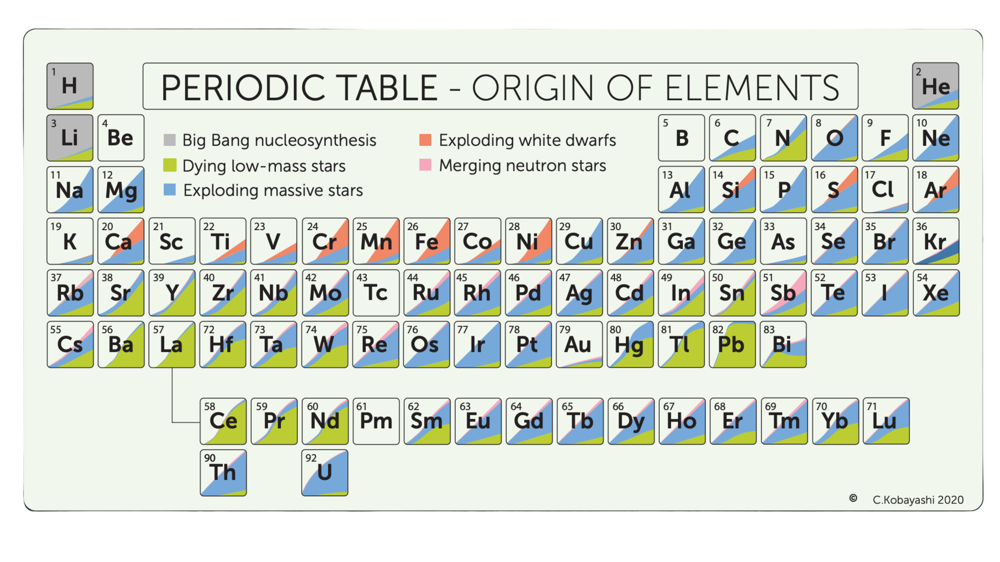

# From Atoms to the Elements: Milestones in Nucleosynthesis and Chemical Evolution

Absolutely — your **original Foundations wording**, with only the table formatting retained:

## Foundations of Atomic Matter

| Date                | Scientist / Event                                                  | Milestone                                              | Reference |
| ------------------- | ------------------------------------------------------------------ | ------------------------------------------------------ | --------- |
| **5th century BCE** | **Leucippus and Democritus**                                       | Concept of an atom (in written form)                   | ref       |
| **1789**            | **Lavoisier**                                                      | The Table of Simple Substances                         | ref       |
| **1804**            | **Dalton**                                                         | Atomic theory                                          | ref       |
| **1829+**           | **Döbereiner, Mendeleev, Myer, Newlands**                          | Periodic table is first organised by physical features | ref       |
| **1860**            | **1st International Conference of Chemistry** (Karlsruhe, Germany) | The atomic mass of hydrogen is one                     | ref       |

Yep — keeping **your wording exactly as written**, just converting each section into the same table format.

## Nuclear Structure & Energy

| Date     | Scientist / Event                     | Milestone                                                       | Reference |
| -------- | ------------------------------------- | --------------------------------------------------------------- | --------- |
| **1896** | **Becquerel**                         | Discovery of the radioactive properties of elements             | ref       |
| **1898** | **(M.) Sklodowska-Curie, (P.) Curie** | Discovery of polonium and radium. Coined the term radioactivity | ref       |
| **1905** | **Einstein**                          | Mass-energy equivalence established                             | ref       |
| **1909** | **Rutherford, Royds**                 | Alpha particles identified as helium nuclei                     | ref       |
| **1911** | **Rutherford**                        | Nuclear atom                                                    | ref       |
| **1913** | **Moseley**                           | The periodic table is re-organized by atomic number             | ref       |
| **1913** | **Thomson**                           | Discovery of stable isotopes                                    | ref       |
| **1920** | **Eddington**                         | Nuclear energy proposed as the source of stellar luminosity     | ref       |
| **1925** | **Payne-Gaposchkin**                  | The sun is mostly H and He                                      | ref       |
| **1928** | **Gamow, Houtermans, Gurney, Condon** | Alpha decay                                                     | ref       |
| **1929** | **Atkinson, Houtermans**              | Quantum tunnelling enables stellar fusion rates                 | ref       |
| **1932** | **Chadwick**                          | Discovery of the neutron                                        | ref       |
| **1932** | **Heisenberg**                        | Proton-neutron nuclear model                                    | ref       |
| **1932** | **Cockcroft, Walton**                 | First nuclear reaction using accelerator                        | ref       |
| **1934** | **Rutherford, Oliphant, Harteck**     | First controlled nuclear fusion reactions                       | ref       |
| **1934** | **(I.) Curie, Joliot**                | Discovery of artificial radioactivity                           | ref       |
| **1934** | **Fermi**                             | Theory of Beta radioactivity                                    | ref       |

## Stellar Fusion & Big Bang Nucleosynthesis

| Date     | Scientist / Event                | Milestone                              | Reference |
| -------- | -------------------------------- | -------------------------------------- | --------- |
| **1938** | **Atkinson, Bethe, Critchfield** | Proton proton cycle                    | ref       |
| **1939** | **von Weizäcker, Bethe**         | CNO cycle                              | ref       |
| **1939** | **Meitner, Frisch**              | Discovery of nuclear fission           | ref       |
| **1948** | **Alpher, Bethe, Gamow**         | the formation of the lightest elements | ref       |
| **1949** | **Mayer, Haxel, Jensen Suess**   | Nuclear shell model and magic numbers  | ref       |

## Formal Stellar Nucleosynthesis Theory

| Date     | Scientist / Event                                                | Milestone                                               | Reference |
| -------- | ---------------------------------------------------------------- | ------------------------------------------------------- | --------- |
| **1954** | **Hoyle**                                                        | Predicted the carbon-12 resonance                       | ref       |
| **1957** | **(M.) Burbidge, (G.) Burbidge, Fowler, Hoyle (B2FH) & Cameron** | Identification of s-, r-, and p-process nucleosynthesis | ref       |
| **1968** | **Bodansky, Clayton, Fowler**                                    | Fe-group abundances linked to radioactive decay of 56Ni | ref       |

## Galactic Chemical Evolution

| Date     | Scientist / Event | Milestone                                                  | Reference |
| -------- | ----------------- | ---------------------------------------------------------- | --------- |
| **1980** | **Tinsley**       | Stellar populations linked to galactic chemical enrichment | ref       |

## Multimessenger & Modern Nucleosynthesis

| Date     | Scientist / Event               | Milestone                                               | Reference |
| -------- | ------------------------------- | ------------------------------------------------------- | --------- |
| **2017** | **GW170817**                    | Neutron star mergers confirmed as major r-process sites | ref       |
| **2020** | **Kobayashi, Karakas & Lugaro** | The Origin of Elements from Carbon to Uranium           | ref       |

https://astro3d.org.au/wp-content/uploads/2024/08/Periodic-Table-Poster-Front-Colour-Blind-version.pdf

