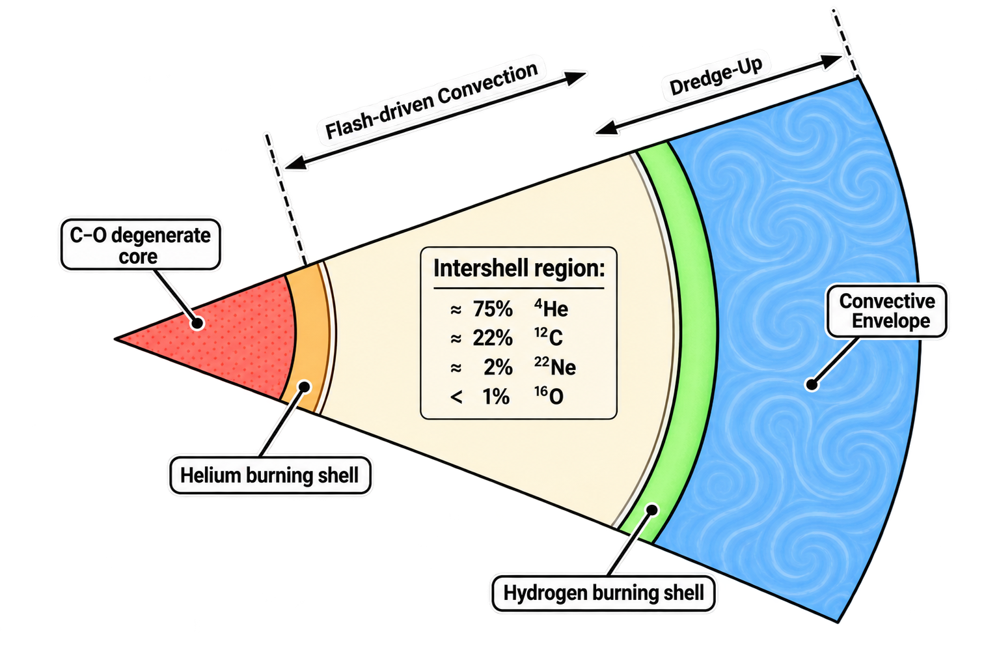

# Nucleosynthesis in Asymptotic Giant Branch Stars

Asymptotic Giant Branch stars are important sites for galactic chemical evolution for several reasons.

- **There are many of them:** The AGB is the evolutionary endpoint of a large fraction of stars in the Universe, so AGB stars make a significant cumulative contribution to the chemical enrichment of galaxies.
- **Low and intermediate mass stars have more time to process material:** Their longer evolutionary timescales allow nucleosynthesis to operate over extended periods, with material repeatedly processed and mixed before it is ultimately returned to the interstellar medium.
- **AGBs couple nucleosynthesis and mixing:** Nuclear burning and mixing occur in different regions of the star, allowing material produced in the interior to eventually reach the surface.
- **Low and intermediate mass stars experience their strongest mass loss during the AGB:** Their expanded envelopes are progressively removed through powerful stellar winds, returning processed material to the interstellar medium on relatively short timescales.
- **AGB nucleosynthesis is highly sensitive to stellar properties:** Initial mass and metallicity strongly influence the stellar structure, temperatures, mixing, neutron sources, and resulting abundance patterns. Surface abundances can therefore provide clues about the properties of individual stars and stellar populations.

This afternoon we will follow the journey of material through an AGB star: where it is produced, how it is transported to the surface, and how it is ultimately returned to the interstellar medium. Along the way, we'll see how changing mass and metallicity can move a star between very different nucleosynthetic regimes, and how we translate these stellar models into the yields used in chemical-evolution models.

---

## What is an AGB star?

The AGB is one of the last active burning stages in the evolution of low- and intermediate-mass stars. Broadly, we are talking about stars with initial masses between roughly 1 and $8 \rm M_\odot$, although that range depends on metallicity and other aspects of the stellar physics.

By the time a star reaches the AGB, it has exhausted its central reserves of hydrogen and helium, leaving behind a carbon–oxygen core. As the core contracts, it moves toward the next stage of nuclear burning, but in low- and intermediate-mass stars it never reaches the conditions required for central carbon ignition. Instead, helium burning ignites in a shell surrounding the C–O core, while hydrogen burning continues in another shell further out.

The result is the characteristic double-shell structure of the AGB; an inactive, degenerate carbon–oxygen core, surrounded by a helium-burning shell and a hydrogen-burning shell. Between the two burning shells is the He-intershell, a thin region whose composition will become particularly important for the nucleosynthesis we discuss later. Outside the burning shells is a large, convective envelope. By this stage, the star has expanded enormously, with a cool, extended envelope surrounding the compact core.

  
   
  <em>AGB structure, based on Figure 14 from Karakas & Lattanzio (2014).</em>

	​

This gives us the basic architecture we need: multiple nuclear-burning sites, a chemically important intershell region, and a large convective envelope surrounding them. The star also undergoes increasingly strong mass loss during this phase, progressively eroding the envelope and eventually exposing the compact remnant. The loss of the envelope marks the end of the AGB, leaving behind a C–O white dwarf in the case of stars that do not proceed to more advanced burning.

But this picture is still static. As the star evolves along the AGB, the structure of these burning regions changes, and with it the conditions under which nucleosynthesis occurs. So what drives this changing structure, and how does it lead to the repeated episodes of nucleosynthesis that characterise the AGB?

---

## The Thermally Pulsing AGB Engine

The defining feature of the thermally pulsing AGB is that the two burning shells do not operate in a steady state. Instead, the star undergoes repeated cycles of **He-shell instability, thermal pulses, envelope expansion, dredge-up, and renewed shell burning**.

### The Early AGB

 After helium-shell burning is established on the early AGB, the H-burning shell continues to deposit helium ash onto the He-burning shell. The He-rich layer therefore becomes progressively more massive and compressed. As the He-burning shell becomes geometrically thinner, it becomes increasingly susceptible to the *thin-shell instability* (see derivation *here*). 

In a sufficiently thin shell, expansion does not provide the usual stabilising feedback: the shell cannot expand enough to reduce its temperature and hence its nuclear energy generation. The result is a thermonuclear runaway, or *thermal pulse*.

### The Thermal Pulse 

Temperatures in the He-burning shell rise rapidly, causing the helium-burning rate to increase sharply through the triple-α reaction,

$$
3 ^4\mathrm{He}\rightarrow{}^{12}\mathrm{C}.
$$

The enormous increase in energy generation drives a *pulse-driven convective zone* through the He-intershell, between the He- and H-burning shells. This region becomes strongly mixed, homogenising the material that has accumulated and been processed in the intershell. The pulse temporarily extinguishes the H-burning shell.

### Third Dredge-Up 

As the pulse subsides, the energy released by the He flash drives the envelope outward. The expansion and cooling of the outer layers eventually allow the convective envelope to penetrate inward into material that has been processed during the pulse. Material from the He-intershell—including newly synthesised $^{12}\mathrm{C}$, $^{16}\mathrm{O}$, and products of neutron-capture nucleosynthesis—is transported into the convective envelope and can subsequently appear at the stellar surface. The third dredge-up therefore provides the critical connection between nucleosynthesis in the interior and observable surface abundances.

**The $^{13}\mathrm{C}$ pocket** is formed as a consequence of the third dredge up. Partial mixing of protons into the $^{12}\mathrm{C}$-rich intershell can produce a $^{13}\mathrm{C}$-rich layer (through $^{12}\mathrm{C}(p,\gamma)^{13}\mathrm{N} \rightarrow ^{13}\mathrm{C}$) which acts as a neutron source through $^{13}\mathrm{C}(\alpha,n)^{16}\mathrm{O}$. The formation and structure of this pocket depend on how mixing is treated at the convective boundary. In sufficiently massive AGB stars, the base of the envelope can become hot enough that protons are burned during dredge-up itself (*hot dredge-up*) which inhibits the formation of a $^{13}\mathrm{C}$ pocket.

### Interpulse Phase

After the thermal pulse, the star relaxes back toward its quiescent configuration. The convective envelope retreats, the H-burning shell is re-established, and the star enters the **interpulse phase**. This is the longest part of the TP-AGB cycle. Hydrogen burns steadily, depositing fresh helium onto the intershell. As the He-rich layer grows, the pressure and temperature at its base increase until the thin-shell instability is triggered again.

#### Hot-Bottom Burning 

There is one additional process that becomes important toward the higher-mass end of the AGB. In sufficiently massive stars, the base of the convective envelope becomes hot enough for hydrogen burning to occur *within the convective envelope itself*. The material at the base of the envelope is repeatedly cycled through this hot region, allowing proton-capture reactions to modify the envelope composition. Depending on the temperature, this can activate the CNO cycles and, at higher temperatures, the Ne--Na and Mg--Al chains. HBB can therefore strongly enhance nitrogen and alter the abundances of Na, Mg, and Al, while simultaneously preventing the envelope from becoming carbon-rich despite continued third dredge-up.

### Summary 

The cycle therefore becomes:

$$
\boxed{\text{Stable H-shell burning}}
\rightarrow
\boxed{\text{He accumulation leads to He-shell instability}}
\rightarrow
\boxed{\text{thermal pulse}}
\rightarrow
\boxed{\text{pulse-driven convection}}
\rightarrow
\boxed{\text{third dredge-up}}
\rightarrow
\boxed{\text{interpulse H burning}}
\rightarrow
\boxed{\text{repeat}}
$$

Importantly, *the cycle is not identical from pulse to pulse*. The core mass, envelope mass, temperature, composition, and mass-loss rate all evolve throughout the TP-AGB. One of the key features of this whole process is that **these cycles repeat many times**. The number of pulses a star experiences, the strength of those pulses, the efficiency of third dredge-up, whether a \(^{13}\mathrm{C}\) pocket forms, and whether HBB operates all depend on the stellar properties. At the same time, the envelope is being progressively removed by stellar winds. The nucleosynthetic products are therefore being *processed, mixed, and ejected repeatedly throughout the AGB*, rather than only at the very end of the star's life.

The next question is, *how do initial mass and metallicity determine which of these processes dominates?*

---

## How Mass and Metallicity Shape AGB Nucleosynthesis

So far, we've looked at the AGB star as a physical system: a degenerate core, two burning shells, a convective envelope, and a sequence of thermal pulses and mixing episodes. But this picture is not the same for every AGB star. What actually comes out of an AGB star can be very different depending on where the star sits in initial mass and metallicity space. These parameters determine the stellar structure and evolutionary timescales, which in turn determine the temperatures and densities reached in the burning regions, the efficiency of mixing, and how long the star has to lose its envelope.

### Metallicity

Metallicity affects AGB nucleosynthesis in two distinct ways. First, it changes the **structure of the star** through quantities such as opacity and mean molecular weight. Second, it changes the **composition of the material being processed**, including the abundance of CNO nuclei and the number of neutron-capture seed nuclei.

- **Opacity ($\kappa$)**: $\kappa$ sources in low- and intermediate-mass stars tend to comprise of metal-dependent transitions (bound free and free absorption). Metal-rich material therefore interacts more strongly with radiation, making it harder for energy to escape through the stellar envelope. The radiative temperature gradient is, 

    $$
    \nabla_{\rm rad} = \frac{3\kappa P L}{16\pi a c G m T^4},
    $$ 

    where \(\kappa\) is the opacity. Increasing the opacity increases the radiative temperature gradient required to transport the stellar luminosity. At a given mass and luminosity, metal-rich stars consequently tend to have more extended, less compact envelopes and cooler surface temperatures than their metal-poor counterparts. This structural difference then feeds directly into the AGB nucleosynthesis: the envelope structure determines the temperatures reached at its base, the efficiency of mixing, and ultimately whether processes such as hot-bottom burning can operate.

#### Mean molecular weight

Metallicity is also accompanied by changes in the initial helium abundance, and therefore in the **mean molecular weight** of the stellar gas. For an ideal gas,

$$
P \propto \frac{\rho T}{\mu},
$$

so increasing the mean molecular weight changes the temperature required to provide pressure support. In our very metal-rich models, the increase in \(\mu\) can become sufficiently important that it offsets some of the structural effects of increasing opacity, producing hotter and more luminous main-sequence models at the highest metallicities ($\rm [Fe/H] > +0.5$).

This has an important consequence: metallicity does not produce a simple monotonic change in every stellar property. Opacity and mean molecular weight act in opposite directions, and their relative importance changes across the metallicity range.

#### Mass loss

The structural changes caused by metallicity also affect the star's mass-loss history.

Mass loss is particularly important on the AGB because the envelope is the reservoir that connects the interior nucleosynthesis to the interstellar medium. Increasing the mass-loss rate removes the envelope more rapidly, reducing both the duration of the TP-AGB and the number of thermal pulses and dredge-up episodes that can occur.

At very high metallicity, this effect can become extreme. In our models, sufficiently strong early-AGB mass loss can remove the envelope before the star even reaches the thermally pulsing phase. For models that do reach the TP-AGB, increasing metallicity generally results in fewer thermal pulses and less efficient mixing. :contentReference[oaicite:3]{index=3}

This is important because a nucleosynthetic product only contributes to the stellar yield if it is both **produced and ejected**. A star can therefore undergo nucleosynthesis internally without making a large contribution to the chemical enrichment of the surrounding medium.

#### H-burning lifetimes

Metallicity also changes the timescale over which the star evolves.

The effect is mediated in part through the mean molecular weight and the resulting luminosity. At very high metallicity, the increased mean molecular weight can produce hotter, more luminous main-sequence stars, while the initial hydrogen abundance is also reduced. The combination leads to significantly shorter hydrogen-burning lifetimes at the highest metallicities. In our \(Z=0.10\) models, the main-sequence lifetime is approximately half that of the corresponding solar-metallicity model. :contentReference[oaicite:4]{index=4}

The exact lifetime is not itself a nucleosynthetic process, but it determines when a population begins returning AGB material to the interstellar medium and therefore matters for chemical-evolution timescales.

#### Composition of the nuclear-burning material

Finally, metallicity changes the **starting composition of the nuclear reactions themselves**.

At higher metallicity, the star begins with larger abundances of CNO nuclei and other heavy elements. This matters particularly for proton-capture nucleosynthesis, where many of the nuclei being processed are already present in the initial composition.

For example, the CNO nuclei act largely as catalysts in the CNO cycle, but their increasing initial abundance means that the resulting abundance changes can be strongly metallicity dependent. In our metal-rich models, this contributes to enhanced production of secondary species such as \(^{14}\mathrm N\), while some initially abundant CNO isotopes experience greater destruction. :contentReference[oaicite:5]{index=5}

Metallicity is also fundamental to neutron-capture nucleosynthesis because it changes the abundance of the seed nuclei onto which neutrons are captured. Combined with the metallicity dependence of the neutron sources and dredge-up, this is one reason why the heavy-element nucleosynthesis of AGB stars changes so strongly across the metallicity range.

So metallicity affects AGB nucleosynthesis through both **the physics of the star** and **the composition of the material being processed**.

### Mass

Initial mass provides the other major axis of the AGB nucleosynthesis landscape.

The most important consequence of increasing mass is that the star develops a more massive core and reaches higher temperatures in its interior. This changes which nuclear-burning regimes become accessible.

#### Pressure and central temperature

A more massive star has a stronger gravitational potential and develops higher pressures and temperatures in its interior. This means that increasing the initial mass can move the star across thresholds for different nuclear reactions.

For AGB stars, this is particularly important for the temperature at the base of the convective envelope. As the stellar mass increases, the base of the envelope becomes progressively hotter, eventually reaching the temperatures required for **hot-bottom burning**.

At solar metallicity, HBB typically begins around the intermediate-mass regime, although the precise mass threshold is model dependent. At a fixed mass, decreasing metallicity generally produces higher temperatures at the base of the envelope and therefore makes HBB easier to activate. :contentReference[oaicite:6]{index=6}

Once HBB is operating, the nucleosynthetic regime changes fundamentally. Instead of relying primarily on material being transported from the He-intershell to the surface, nuclear processing occurs directly at the base of the convective envelope. Depending on the temperature, this can activate the CNO cycles and the Ne--Na and Mg--Al chains, strongly affecting the abundances of C, N, O, Na, Mg and Al.

Mass also affects the efficiency of third dredge-up. In general, TDU becomes more efficient with increasing stellar mass and decreasing metallicity, although the precise behaviour depends on the stellar evolution model and its treatment of convective boundaries. :contentReference[oaicite:7]{index=7}

This gives us a useful first-order picture:

$$
\boxed{
\begin{array}{ccc}
\text{Low mass}
&\longrightarrow&
\text{cooler envelopes, TDU, }^{13}\mathrm C\text{ neutron source}
\\[0.5em]
\text{Intermediate mass}
&\longrightarrow&
\text{hotter envelopes, HBB, }^{22}\mathrm{Ne}\text{ neutron source}
\end{array}}
$$

with metallicity shifting the boundaries between these regimes.

This is why there is no single nucleosynthetic signature for an AGB star. *Mass and metallicity determine which physical processes are available, how efficiently they operate, and whether their products ultimately reach the surface and are ejected.* And this gives us the framework for the rest of the lecture: rather than treating all AGB stars as one nucleosynthetic site, we can now move through the mass--metallicity plane and ask which processes dominate in each regime.

---

## Metal-Rich AGB Stars: $^{13}\mathrm{C}$ and $^{22}\mathrm{Ne}$ Neutron Sources

At approximately solar and super-solar metallicity, AGB nucleosynthesis follows the classical picture of two main neutron sources, with their relative importance determined primarily by stellar mass.

### Low-mass AGB stars: the $^{13}\mathrm{C}$ neutron source

In low-mass AGB stars, the dominant neutron source is

$$
^{13}\mathrm{C}(\alpha,n)^{16}\mathrm{O},
$$

which operates during the **interpulse phase** in the He-intershell.

The \(^{13}\mathrm{C}\) is produced in a \(^{13}\mathrm{C}\)-rich pocket formed through partial proton mixing into the \(^{12}\mathrm{C}\)-rich intershell:

$$
^{12}\mathrm{C}(p,\gamma)^{13}\mathrm{N}
\rightarrow
^{13}\mathrm{C}.
$$

The relatively low neutron densities and long neutron exposure are characteristic of the classical **main s-process**. The resulting neutron captures progressively build nuclei beyond iron, with the final abundance distribution depending strongly on the neutron exposure and the initial abundance of seed nuclei.

### Intermediate-mass AGB stars: the \(^{22}\mathrm{Ne}\) neutron source

At higher initial masses, the He-shell reaches higher temperatures during thermal pulses, allowing the reaction

$$
^{22}\mathrm{Ne}(\alpha,n)^{25}\mathrm{Mg}
$$

to become an important neutron source.

Unlike the \(^{13}\mathrm{C}\) source, the \(^{22}\mathrm{Ne}\) source operates **during the thermal pulse**, within the pulse-driven convective zone. It produces higher neutron densities but over shorter timescales, activating branching points in the s-process path that are less important for the \(^{13}\mathrm{C}\) source.

The two neutron sources therefore probe different regions of the AGB:

$$
\boxed{
^{13}\mathrm{C}(\alpha,n)^{16}\mathrm{O}
\quad\text{interpulse}
}
\qquad
\boxed{
^{22}\mathrm{Ne}(\alpha,n)^{25}\mathrm{Mg}
\quad\text{thermal pulse}
}
$$

The \(^{22}\mathrm{Ne}\) source also produces \(^{25}\mathrm{Mg}\) and \(^{26}\mathrm{Mg}\) through competing \(\alpha\)-capture reactions.

### The effect of metallicity

Metallicity then determines how efficiently these neutron sources can build heavy nuclei.

At lower metallicity, there are fewer Fe-peak seed nuclei available per neutron. The neutron-to-seed ratio therefore increases:

$$
\text{lower } Z
\quad\rightarrow\quad
\text{higher neutron/seed}
\quad\rightarrow\quad
\text{heavier s-process distribution}.
$$

Lower-metallicity models also tend to experience stronger thermal pulses and more efficient third dredge-up, allowing more of this material to reach the stellar surface.

At high metallicity, the opposite trend occurs. Increasing metallicity suppresses third dredge-up and reduces the number of thermal pulses through stronger mass loss. At sufficiently high metallicity, the envelope can even be lost before significant thermal-pulse nucleosynthesis occurs.

Thus, increasing metallicity does not simply change the initial composition of the star: it changes whether the star can efficiently produce, mix, and eject newly synthesised heavy elements.

---

## Metal-poor Low and Intermediate Mass AGBs: From the s-Process to the i-Process

As we move to lower metallicity, the classical s-process becomes increasingly efficient at producing heavy elements.

Lower-metallicity AGB stars experience stronger thermal pulses and more efficient third dredge-up, while the reduced abundance of seed nuclei increases the neutron-to-seed ratio. This favours the production of heavy s-process elements and large surface enrichments in carbon.

The picture becomes more interesting at **very low metallicity**, where the separation between the H- and He-burning regions can become important for the nucleosynthesis.

### Primary carbon and nitrogen

Third dredge-up brings freshly synthesised \(^{12}\mathrm{C}\) from the He-intershell into the envelope. Because this carbon was produced from helium burning rather than inherited from the initial metallicity, it is a **primary** product.

At low metallicity, this newly produced carbon can subsequently be processed through the CNO cycle:

$$
^{12}\mathrm{C}
\rightarrow
^{14}\mathrm{N}.
$$

This provides a pathway to **primary nitrogen**:

$$
\boxed{
\text{He burning}
\rightarrow
^{12}\mathrm{C}
\rightarrow
\text{H burning}
\rightarrow
^{14}\mathrm{N}
}
$$

The AGB can therefore contribute primary C and N even when the star began with very little metal content.

### Proton ingestion and the i-process

At sufficiently low metallicity, mixing between the H-rich envelope and the He-burning region can lead to **proton-ingestion events**.

Protons mixed into the \(^{12}\mathrm{C}\)-rich He-burning material can produce \(^{13}\mathrm{C}:

$$
^{12}\mathrm{C}(p,\gamma)^{13}\mathrm{N}
\rightarrow
^{13}\mathrm{C},
$$

which can subsequently undergo

$$
^{13}\mathrm{C}(\alpha,n)^{16}\mathrm{O}.
$$

If this occurs while the He-burning region is convective, the resulting neutron production can reach densities substantially higher than those characteristic of the classical s-process.

This opens the **intermediate neutron-capture process**, or **i-process** regime:

$$
n_{\mathrm{s}}
<
n_{\mathrm{i}}
<
n_{\mathrm{r}}.
$$

The higher neutron densities move the neutron-capture path further from the valley of stability and activate branching points that are not accessible under classical s-process conditions.

The important point is that decreasing metallicity does not simply produce *more* of the same s-process nucleosynthesis. At sufficiently low metallicity, the stellar structure can change enough to introduce **new nucleosynthetic pathways**.

---

## Metal-free Low and Intermediate Mass AGBs: The First AGB Stars

At the extreme limit of the metallicity axis are the first, metal-free stars.

These stars begin with essentially no CNO nuclei. Their early hydrogen burning therefore cannot initially rely on the CNO cycle and instead proceeds primarily through the pp chains.

The situation changes once helium burning begins.

### Producing the first CNO nuclei

The triple-\(\alpha\) reaction produces the first significant carbon:

$$
3\,^4\mathrm{He}
\rightarrow
^{12}\mathrm{C}.
$$

This carbon can then be transported into regions where hydrogen burning occurs and converted through the CNO cycle into \(^{14}\mathrm{N}.

The star therefore begins to **manufacture its own CNO catalysts**:

$$
\boxed{
\text{He burning}
\rightarrow
^{12}\mathrm{C}
\rightarrow
\text{CNO cycling}
\rightarrow
^{14}\mathrm{N}
}
$$

This makes the nucleosynthesis of metal-free stars fundamentally different from that of metal-rich AGB stars: much of the material being processed was not present in the initial composition.

### H--He interaction

At zero metallicity, the interaction between the H- and He-burning regions can become particularly important. Mixing events can transport protons into the He-burning region, producing \(^{13}\mathrm{C}\) and potentially generating high neutron densities.

Depending on the stellar mass and the treatment of mixing, these proton-ingestion events can therefore lead to:

- primary \(^{12}\mathrm{C}\);
- primary \(^{14}\mathrm{N}\);
- production of other light elements;
- neutron-capture nucleosynthesis;
- and potentially i-process conditions.

The exact behaviour is strongly model dependent, so the metal-free regime should not be thought of as a single nucleosynthetic pathway.

The key point is that the first AGB stars occupy an extreme regime in which **He burning creates the CNO material required for subsequent H burning**, while interactions between the H- and He-burning regions can open additional neutron-capture pathways.

---

## Super AGBs: The High-Mass Limit

## AGBs in Binaries

## The AGB Nucleosynthesis Landscape: Mass x Metallicity

## From Stellar Models to Nucleosynthetic Yields