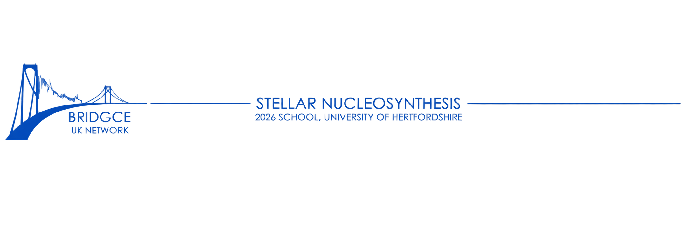

\begin{center}

{\huge\bfseries The \textit{Stellar} Origins of the Elements}

\vspace{0.6cm}

{\Large Dr Giulia Cinquegrana}

\end{center}

## Intro. 1 min 30. 

> [Slide 1]

Over the next 30 minutes, my aim is to give you a broad understanding of stellar nucleosynthesis.

I'll start with a brief history of the field. I started putting this together when I was writing my own thesis because im a history geek, but it did help me see where my own work fit into the field, and what questions we might want to be asking in modern astronomy - where the direction is going today. 

Next, we'll trace the chains and processes behind chemical enrichment: from light-element fusion up to our heaviest elements, made by neutron capture and photodisintegration.

Then we'll turn to the stellar sites where these chains occur: so hydrostatic environments in low-mass and massive stars, as well as their dynamical burning stages and interactions. I'll note that my expertise is predominantly in single star AGB nucleosynthesis and 8 to 30 solar mass pop I supernovae, but I'll touch on other sites too and if these catch your interest, you should find someone here this week who works on it and quiz them. 

I'll then step back and let you get hands-on: a mini-lab on the nucleosynthetic signatures we'd expect from different environments and what they actually might look like.

And then we'll close with a 10–15 minute session on stellar yields. Half a day isn't enough to teach you to calculate your own responsibly, but you should leave understanding three things: what we mean by "yields," what stellar-model calculations look like, and where we might want to be a little bit careful about 1D versus 3D, and so on.

> [Slide 2]

Let's start by looking at the giants.

## History. About 6 mins. Should be 8. 

> [Slide 3]

In 1900, we still thought that stars shone by gravitational contraction. Einstein changed this picture by demonstrating, through the mass-energy equivalence, that nuclear reactions could supply energy. So in 1920, Eddington took this and proposed that nuclear reactions could be the source of *stellar* energy. Though at this point, he was operating under the assumption that this was happening with just 5–7% hydrogen in the star. He, and everyone else at the time, still assumed stars were made of the same ingredients as the Earth — mostly heavy elements.

A few years later, a mentee of Eddington's, Cecilia Payne-Gaposchkin, was working on her PhD at Harvard Observatory. She was using stellar spectroscopy to map the Sun's composition for the first time, and found — which she initially called an error in her thesis — that the Sun was actually mostly light elements: 70% hydrogen, 28% helium, with only 2% metals.

This gave us two big pieces of the puzzle: stars were made mostly of the lightest elements, and nuclear reactions among them could power stars. But we still didn't know how those reactions worked inside stars, or where the heavier elements came from.

> [Slide 4]

To answer that, we need to rewind and pick up a second thread in physics and chemistry. In 1896, Becquerel discovered radioactivity, and the Curies soon showed it could transform one nucleus into another. In 1913, Moseley reorganized the periodic table by atomic number, giving us the modern layout that we are familiar with today. Through the 1920s and '30s, we came to understand the nucleus itself: the proton, then the neutron in 1932, and quantum mechanics gave us a framework for nuclear reactions.

> [Slide 5]

This then brings us to the glory days of stellar nucleosynthesis, where these two threads — astronomy and nuclear physics — finally meet. Gamow and Houtermans applied quantum tunnelling to nuclear reactions, showing that charged particles could cross the Coulomb barrier without the classical energy needed to clear it. Atkinson and Houtermans used this to calculate some of the first stellar reaction rates. By the 1930s, we had experimental evidence for fusion, and theory was catching up fast. Atkinson proposed proton fusion as a stellar energy source; Bethe and Critchfield formulated the proton–proton chain; Bethe and von Weizsäcker independently worked out the CNO cycle. We now understood how stars turn hydrogen into helium. But the bigger question remained: where do the rest of the elements come from? The heavier ones, but also where hydrogen initially came from. 

In the 1940s and '50s, the picture widened from stellar energy to full nucleosynthesis. Ralph Alpher, another phd student (no pressure guys), proposes the formation of the lightest elements through big bang nucleosynthesis for his thesis. In terms of the heavy elements, Fred Hoyle did a lot of the heavy lifting here. He proposed that carbon through the iron group could form during the hot late stages of massive-star evolution. In 1957, Margaret and Geoffrey Burbidge, William Fowler, and Hoyle brought the story together in Synthesis of the Elements in Stars — the paper that made stellar nucleosynthesis a proper framework: different reactions under different stellar conditions, including neutron-capture and photodisintegration processes beyond iron.

As computing advanced, stellar models could follow stars through progressively more complex phases — helium-shell burning, thermal pulses on the AGB, dredge-up, the explosive burning of massive stars. We moved from asking whether stars make elements to asking which isotopes, in what quantities, under what conditions.

> [Slide 6]

Then in the '80s, we needed to zoom out a bit. Stars are the sources of the elements, but that enrichment has to be scaled up to the level of a whole galactic ecosystem to actually represent what we are observing. Beatrice Tinsley, among others, built the first galactic chemical-evolution models, finally connecting individual stars to the systems they live in. These models asked population-level questions: given a star formation history and an initial mass function, how many stars of each mass are needed to reproduce the abundances we see in galaxies today? On what timescales do different sources — core-collapse versus Type Ia supernovae — enrich the gas, and how does that imprint itself on abundance ratios like [α/Fe]? And how do gas flows — infall, outflow, mixing — reshape that picture further?

> [Slide 7]

That brings us to now. Compared with even two decades ago, we have far greater computational power: detailed stellar models on one end, and huge galaxy simulations on the other. We have high-resolution stellar-yield grids, nuclear reaction networks, and increasingly sophisticated multidimensional simulations. 

Observationally, we have just as much: high-resolution spectroscopy giving detailed elemental and isotopic abundance patterns, and surveys like Gaia giving positions, motions, and populations across the Galaxy. Increasingly, we can combine observations across the electromagnetic spectrum, and multimessenger data, with these theoretical models.

So we now have something the early pioneers lacked: both detail and scale. We can calculate the nuclear physics in individual stars, trace how yields depend on mass and composition, and then ask how those products propagate through a galaxy. That means our questions are getting sharper. How does metallicity change a star's yields? How do mixing and mass loss alter its nucleosynthesis? Which reaction rates control which isotopic signatures? Which stellar populations produced the patterns we see today? And how do those signatures propagate through a galaxy's evolution?

**need linking sentence here**

## Elements < Fe [should be 8 minutes]

> [Slide 8]

So lets start looking into some of these processes specifically. 

For elements lighter than iron, the dominant processes are typically charged-particle reactions (fusion) together with photodisintegration in the very hottest stages.

The basic idea behind fusion is fairly simple. Positively charged nuclei repel each other through the Coulomb force. So, to fuse two nuclei, you have to get them close enough that the strong nuclear force can take over. The problem is that the Coulomb barrier gets larger as you move to nuclei with more protons. 

So hydrogen burning is comparatively easy. You can fuse protons at temperatures of roughly a few million kelvin. And then, as the star evolves and the central temperatures increase, it moves through progressively hotter burning stages.

Our lowest temperature H burning (~4e6K) begins through the proton proton chain. We start by producing a He3 nucleus. And then if this occurs twice, an alpha particle can form via the ppI chain. Once alpha particles are present, He3 can combine with more alpha particles through pp-II or a proton thorugh the pp-III chain. Which chain dominates is a function of temperature and density. 

> [Slide 9]

So if we want to produce Li rich giants on the AGB with the cameron fowler mechanism, we need temperatures cool enough that the second pp chain dominates produces Li, and then that Li is mixed convectively to cooler regions before it can capture an alpha particle. If temperatures are too hot, we'll be moving towards the pp-III chain, or even the CNO cycle. 

> [Slide 10]

For the CNO cycle, we need both (a) sufficiently high temperatures, as well as (b) heavy seeds intially present in the gas. 

At this point, I want to take a second to define primary versus secondary nucleosynthesis products. Primary nucleosynthesis products are the result of purely H and He burning. No metal seeds need to present for processes like the pp chain to operate. Secondary nucleosynthesi products require heavy seeds present in the gas at stellar birth. So processing via the CNO cycle generates secondary nucleosyntehsis products, and neutron capture which I'll talk about later is a secondary process because it requires Fe seeds be already present in the gas. Why does this matter? When talking about the chemical enrichment of galaxies, an AGB star for example making large amounts of primary nitrogen means that there is a net nitrogen increase within that chemical budget. If its secondary nitrogen through the CNO cycle, then you have just re-arranged the metals within that budget, rather than creating fresh metals. 

Okay so if we have carbon in the gas and central temperatures exceeding around 1.8e7K, we can star the CNO-I cycle, and at hotter temperatures, CNO-II. The CNO cycle is the dominant mode of H burning in stars more massive than about 1.2Msun, that are not metal-free (special snowflakes). When you operate the full CNO cycle, our bottlenck reaciton is N14(p,gamma)O15 because it requires an electronmangetic rather than a strong ineraction. In practice, this means that the dominant product of the CNO cycle is N14. 

> [Slide 11]

If we get to even higher temperatures during H burning, we can initiate the Ne-Na and Mg-Al chains. If you're interested in globular clusters and their sass, these chains are particularly important for the light element anticorrelations that define GCs. 

> [Slide 12]

For successively higher temperatures, we can then start fusing heavier nuclei. Obviously require much greater pressures and temperatures than H burning, so now we start limiting the successive phases we go thorugh based on our initial mass regime. 

Helium burning starts at around $10^8$ K, where three alpha particles combine to form C12 via the triple-alpha reaction. Once you have carbon, you can capture alpha particles to make $^{16}\mathrm{O}$, and eventually $^{20}\mathrm{Ne}$. 

Carbon and oxygen burning are our heaviest stages that still have nicley formed reaction channels. For both stages, we have a variety of outcomes possible. 

> [Slide 13]

Although the Mg24 channel has the largest Q value, it results in an excited Mg24 nucleus. The cross section for p, n or alpha emission is much greater than that to emit a gamma particle. So the Ne20 and Na23 channels become the most probable. 

Similarly for oxygen burning, the alpha and proton reactions are the most probable results. 

> [Slide 14]

The order here is a bit funky. Neon burning operates at temperatures lower than oxygen burning, however its Ne and Si burning that we begin to deviate from our nicely formed chains and cycles. 

Neon burning is initiated by alpha capture on O16. For this reaction though, its reverse reaction rate (in other words, its photodisintegration rate) rivals the forward rate at temperatures of around 1.2e9K (lower than O burning would need to achieve for its reverse rates to apprach forward). 

The reverse rate is the (energy?) needed to knock a particle from a nuclide. So for example, at temperatures of 1.2e9K, the likelihood of Ne20 losing a alpha particle is pretty similar to that of O16 capturing an alpha particle to form Ne20. And so what you begin to have is this equalization of species (in little circles at the moment).

After oxygen burning then when we reach temperatures for silicon burning, again we're now not looking at fusion anymore but the forward rates for Si burning rival their reverse rates. Beginning at somewhat mild temperatures of 3e9K, we have what we call partial photodisintegration or partial silicon burning. As particles are being knocked out of these nuclei that we've spent years building, their emissions are more likely to be captured by iron group nuclei over the lighter stages, because these nuclei have some of the highest binding energies per nucleon. 

When T increases to 5e9K, we get more and more reaction groups start to equalize into a quasistatstical equilibrium, which just means those groups are isolated from each other typically by reactions involving nuclei with atomic numbers less than 24. As the silicon content reaches zero, these last reactions also come into equilibrium, so we then reach a full nuclear statsitcal equilibrium via both the electromagnetic and strong nuclear force. 

so basically during these stages, nuclei are continually being broken apart and reassembled, but they are being reassembled into different species than we preivously made. While the abundance distribution tends to be centred around the iron group, the final composition resulting from the equilibrium processes is largely determined by things like temperature, density, nuclear binding energies and the electron fraction, $Y_e$. 

**What is the electron fraction? XXX** 

**The density determines whether we get freeze out or not XXX** 

> [Slide 15]

So the C through Si burning we need massive stars to reach these temperatures. After NSE is reached, we approach core collapse **details**

**We either have direct collapse to a black hole, or a supernovae reobound shock.detailsXXX**

> [Slide 16]

Once we get beyond iron, fusion is no longer the obvious way to build heavier nuclei. The Coulomb barrier is just too large. Instead we need to do some sneaky nucleosynthesis. 

> [Slide 17]

One way we do that is by using our particle with no electric charge as a trojan horse with neutron capture. This is a secondary process given that we need to have Fe seeds in the gas at stellar birth. 

Okay so if we have Fe seeds around, and a source of free neutrons, the heavy nuclei can capture a neutron quite easily. If that forms a stable isotope, than thats it! Same element, just a heavier isotope species. If its now unstable, the neutron will decay to a proton building a heavier element along the periodic tables. 

What species we build with this depends on the competition between beta decay and successive neutron captures. if captures happen slowly and allow for decay to occur between captures, then we closely follow the valley of stability on the chart of the nuclides. This is the slow nteutron capture process, and it results in three main s-process magic nuclear peaks. The first at Sr, Y and Zr, the second at Ba, La and friends, and the last peak at Pb. These are sinks for capture. They have special nuclear configurations which are particlarly stable (the magic neutron numbers $N=50$, 82 and 126). And so we see in solar system abundances. 

**If successive captures are faster than beta decay, then we start deviating off the valley. The extreme of this is the rapid neutron capture process, which results in these peaks instead. They will go all the way up to XX and then decay back to XX. In between the s and r processes, we have the intermediate capture process and the n-burst which is higher again than i but less than r.** 

### P-process

> [Slide 18]

Neutron capture is brilliant but its not the only method, since we also need a way to produce heavy proton rich species, the so-called p-nuclei. This is sometimes called p-process, or gamma process, but effectively its the photodisintegration we were just talking about. So rather than adding neutrons to build heavier nuclei, we start with pre-existing heavy nuclei and use very energetic photons to knock particles out. So you can have reactions such as

$(\gamma,n),\quad(\gamma,p),\quad(\gamma,\alpha).$

Initially, $(\gamma,n)$ reactions tend to move nuclei towards the proton-rich side of the nuclear chart. Eventually, $(\gamma,p)$ and $(\gamma,\alpha)$ reactions become important and the reaction flow branches between isotopic chains. This occurs in explosive environments at temperatures of roughly a few $10^9$ K, particularly in regions undergoing explosive Ne/O burning. So again, we're not just adding material to the periodic table. We're reprocessing nuclei that already exist.

> [Slide 19]

And finally, there are a collection of processes that don't fit neatly into these two big categories.

There are neutrino-driven processes, such as the $\nu$-process and $\nu p$-process, where neutrino interactions alter the composition of material during stellar explosions. **more detail**

Okay so the important point isn't necessarily that you remember every name. It's that there isn't one single process responsible for everything beyond iron. There are different neutron densities, temperatures, proton-to-neutron ratios and timescales, and each of these changes the path through the nuclear chart. 

## Astrophysical Sites [8 minutes]

> [Slide 20] 

UP TO HERE

So now we've talked about the nuclear physics: the different ways we can build, destroy and rearrange nuclei. The next question is: **where does all of this actually happen?** And this is where stellar evolution becomes really important. The nuclear reactions don't happen in isolation. 

A star's mass determines how hot and dense its interior becomes, how far it can progress through the different burning stages, how it mixes material, and ultimately how that material gets returned to the interstellar medium. So there isn't one single stellar site for nucleosynthesis. We have relatively low-mass stars, massive stars, stellar explosions, and some much more extreme environments. I'll split these into two broad categories: **hydrostatic burning**, where nuclear reactions occur during the normal evolution of a star, and **dynamic burning**, where the conditions change very rapidly — usually because something explodes.

### Hydrostatic burning

Let's start with hydrostatic burning. This is nucleosynthesis that happens while the star is still approximately in hydrostatic equilibrium. The star is supported against gravity, and the nuclear reactions are operating over evolutionary timescales. The important thing here is that different masses of star experience very different evolutionary paths.

#### Low and intermediate mass stars

For low- and intermediate-mass stars — roughly stars that end their lives as white dwarfs rather than core-collapse supernovae — the later stages of evolution are particularly interesting for nucleosynthesis. They burn hydrogen and helium in shells around an inert core, and eventually reach the asymptotic giant branch, or AGB. This is where we get thermal pulses: unstable episodes of helium-shell burning that can drive convection through the intershell region. These stars are important sites of the **s-process**. In particular, a small amount of carbon can be converted into \(^{13}\mathrm{C}\), which then undergoes

\[
^{13}\mathrm{C}(\alpha,n)^{16}\mathrm{O}.
\]

This provides a relatively low-density but long-lived source of neutrons. During the thermal-pulse phase, we can also activate

\[
^{22}\mathrm{Ne}(\alpha,n)^{25}\mathrm{Mg},
\]

which produces a much shorter, higher-density neutron burst. The material produced in these regions doesn't necessarily stay buried inside the star. Through processes such as third dredge-up, material from the intershell can be mixed into the envelope and eventually lost through stellar winds. So AGB stars are essentially little chemical factories: they process material internally and then gradually return those products to the interstellar medium. And importantly, what they produce depends strongly on the initial mass and metallicity of the star.

#### Massive stars — SNe Type II progenitors

Then we move up in mass to stars that are massive enough to undergo core collapse. These stars can progress through a sequence of increasingly hot burning stages:

\[
\mathrm{H} \rightarrow \mathrm{He} \rightarrow \mathrm{C}
\rightarrow \mathrm{Ne} \rightarrow \mathrm{O} \rightarrow \mathrm{Si}.
\]

Each stage happens at a higher temperature and on a shorter timescale. Hydrogen burning can last millions of years, while the final burning stages can occur over years, days, or even less. These stars therefore produce a huge range of nuclei through hydrostatic burning before they ever explode. They are particularly important for the alpha elements and for the weak s-process. The \(^{22}\mathrm{Ne}(\alpha,n)^{25}\mathrm{Mg}\) reaction becomes an important neutron source during helium and carbon burning, producing neutron-capture elements roughly around the first s-process peak. And then, at the end of the star's life, everything changes. The core collapses. That takes us into dynamic burning.

#### Really massive stars — X progenitors

And then there are the really massive stars. These are the stars where the distinction between "normal massive star" and "extreme stellar object" starts to become interesting. At sufficiently high initial mass, the star can experience much stronger mass loss, very different internal evolution, and potentially avoid the standard Type II supernova pathway. Depending on the mass, metallicity, rotation and mass-loss history, these stars can evolve into stripped-envelope stars or other extreme progenitors. And this is important because the nucleosynthesis isn't determined by mass alone. The star's rotation can change its internal mixing. Magnetic fields can transport angular momentum and chemical species. Mass loss can remove the outer layers before they are ever involved in the final explosion. So two stars with the same initial mass can potentially return quite different chemical compositions to their surroundings. This is one of the reasons stellar modelling becomes increasingly complicated as we move towards the upper end of the mass range. And some of the most extreme cases don't just have unusual stellar evolution — they produce completely different explosion mechanisms.

### Dynamic burning

So now we move from stars that are evolving relatively slowly to environments where the physical conditions change extremely rapidly.

#### SNe Type II explosions

The first example is the core-collapse supernova. When a massive star reaches the end of its hydrostatic burning, it develops an iron-group core. Iron is essentially the end of the line for energy-producing fusion. Trying to fuse iron into heavier nuclei costs energy rather than releasing it. The core therefore becomes unstable and collapses. The collapse produces enormous temperatures and densities, and a shock wave propagates through the layers of the star. This suddenly processes material that was previously sitting in different burning shells.

So the explosion isn't simply adding one final nucleosynthesis process on top of the hydrostatic evolution. It can completely reprocess material that the star has already produced. We get explosive carbon, neon, oxygen and silicon burning, along with photodisintegration and neutron-capture processes. And because the explosion moves through different layers with different compositions, the final abundance pattern is a combination of everything that happened during the star's life and everything that happened during the explosion. This is why the yields of a supernova are so sensitive to things like the initial mass, metallicity, explosion energy, electron fraction and the details of the stellar structure.

#### Crazy-big-star explosions, magnetars, and magnetically driven explosions

And then we can push this even further. There are some extremely energetic explosions where the standard picture of a spherical core-collapse supernova is no longer sufficient. If the progenitor is rapidly rotating and has a strong magnetic field, the collapse can produce a highly magnetised compact object — potentially a magnetar — and magnetic fields can become dynamically important in launching or shaping the explosion. These magnetically driven explosions can produce conditions very different from an ordinary supernova. You can get different entropies, different neutron-to-proton ratios, different expansion timescales and potentially much stronger outflows. And this is where some of the more exotic nucleosynthesis possibilities appear. The exact conditions matter enormously. Small changes in the electron fraction, entropy or expansion timescale can change whether the material is neutron-rich or proton-rich, and therefore which nuclear pathways are available. So when we talk about things like the r-process or the \(\nu p\)-process, we're not just asking "does a supernova happen?" We're asking **what kind of supernova, with what progenitor, what rotation, what magnetic field, and what conditions in the ejecta?**

This is also where different groups' simulations can give quite different nucleosynthetic predictions. For example, the work by Vishnu and Chiaki explores different regimes of massive-star explosions and demonstrates just how sensitive the resulting yields can be to the underlying explosion physics. So even once we've identified an astrophysical site, we haven't necessarily solved the nucleosynthesis problem. We still need to understand the detailed physics of that site.

#### Type Ia supernovae

Finally, we have Type Ia supernovae. These are fundamentally different from core-collapse supernovae. Rather than being the explosion of the core of a massive star, they involve a carbon–oxygen white dwarf undergoing a thermonuclear explosion. The white dwarf is already made primarily of material produced during earlier stellar evolution, but during the explosion it is heated to enormous temperatures and densities. This drives rapid nuclear burning towards the iron group, with large amounts of radioactive \(^{56}\mathrm{Ni}\) being produced. That \(^{56}\mathrm{Ni}\) subsequently decays through \(^{56}\mathrm{Co}\) to \(^{56}\mathrm{Fe}\), powering the characteristic light curve of the supernova.

So Type Ia supernovae are particularly important contributors to the iron-group elements. And again, the final yields depend on the explosion mechanism and the structure and composition of the white dwarf. So even within one broad category — "supernova" — we have fundamentally different nucleosynthetic environments.

## Takeaways

So, if there's one thing I want you to take away from this lecture, it's that there isn't one single site where nucleosynthesis happens. Different elements, and different nucleosynthesis processes, are telling us about different stellar environments. The temperature, density, neutron flux, timescale, electron fraction, and all of the other conditions determine which nuclear reactions can actually occur. And those conditions come from the evolution of the star — its mass, metallicity, mixing, mass loss, rotation, and, ultimately, how it dies.

So when we observe an abundance pattern in a star, we're really looking at the combined result of nuclear physics and stellar evolution. The challenge is to work backwards from those abundances and ask: what kind of environment could have produced this? And that's really what we're going to start doing in the next part. We're going to take a 30-minute lab, where you'll get to work with stellar yields and actually look at how the predictions change between different stellar models. Then we'll finish with a short 15-minute discussion about stellar yields — what they actually represent, how they're calculated, and some of the challenges involved in making those predictions. And then, in the next session, we're going to specialise in one particular site: AGB stars and AGB nucleosynthesis. So today we've built the big picture — what elements are made, through which processes, and where those processes can occur. Next time, we'll zoom in on one of those sites and look at it in much more detail.